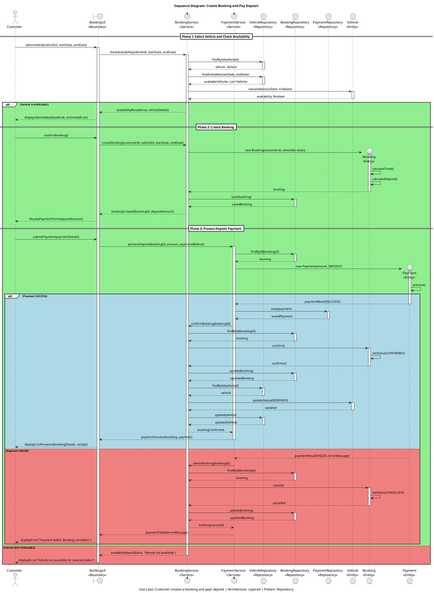
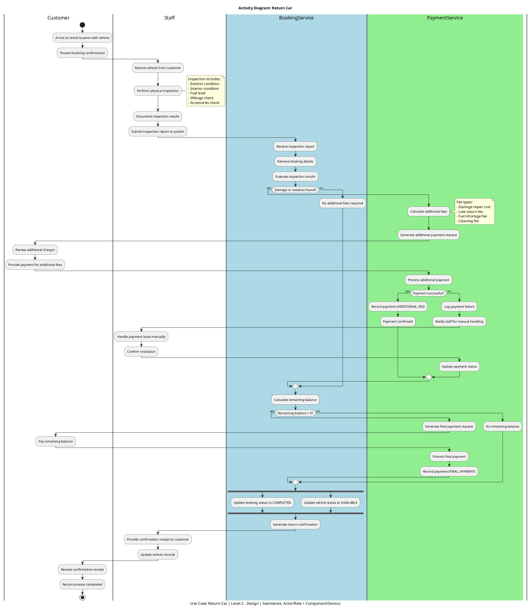
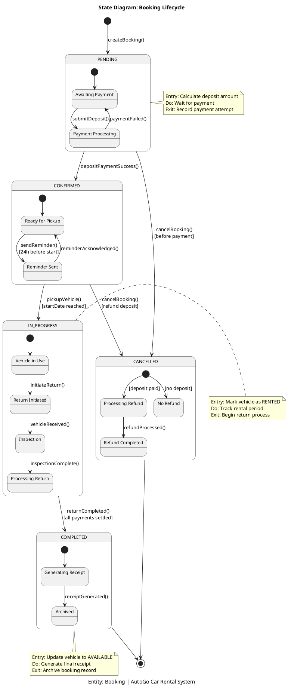
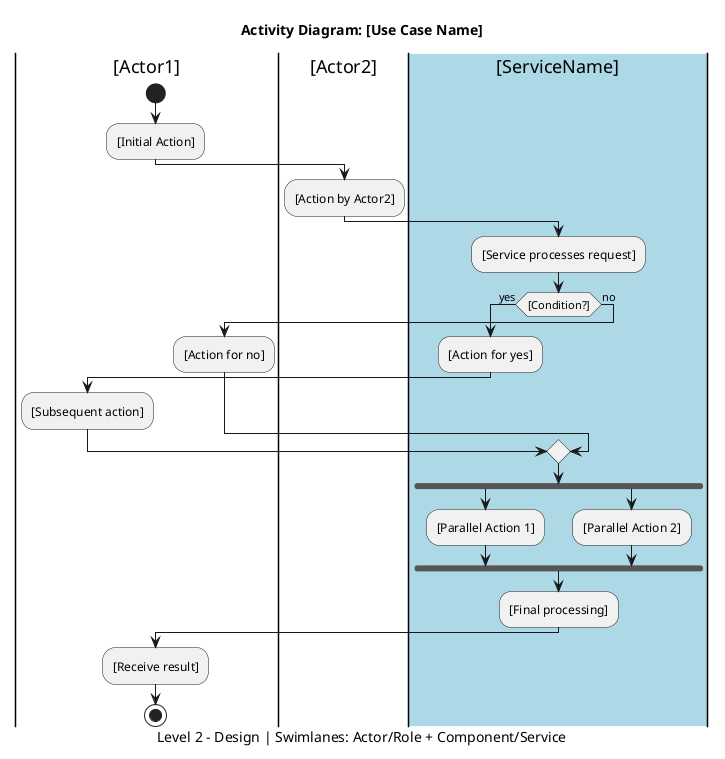

# 📋 SWD392 PRACTICAL EXAM - COMPLETE SOLUTION
## AutoGo Car Rental System

---

# 📌 EXAM SUMMARY

| Item | Detail |
|------|--------|
| **System** | AutoGo - Online Car Rental |
| **Architecture** | Layered Architecture (chosen) |
| **Mandatory Pattern** | Repository Pattern |
| **Duration** | 85 minutes |

## Business Context
- Customers: Browse cars, make bookings, pay deposits, return cars, complete remaining payment
- Staff: Manage vehicles, confirm bookings, inspect cars upon return
- System: Auto-update booking and vehicle statuses

---

# ═══════════════════════════════════════════════════════════════
# QUESTION 1: CLASS DIAGRAM (3.0 Points)
# ═══════════════════════════════════════════════════════════════

## 📝 Description

### Purpose
This Class Diagram represents the **design-level** structure of the AutoGo Car Rental System. It illustrates the domain entities, their attributes, methods, relationships, and the implementation of the Repository Pattern following Layered Architecture principles.

### Architecture Approach
- **Layered Architecture** is applied with clear separation between:
  - **Domain Layer**: Entity classes (User, Customer, Staff, Vehicle, Booking, Payment)
  - **Repository Layer**: Data access interfaces and implementations
  - **Service Layer**: Business logic handling

### Key Design Decisions
1. **Inheritance**: Customer and Staff inherit from abstract User class
2. **Repository Pattern**: Generic IRepository interface implemented by specific repositories
3. **Aggregation/Composition**: Booking aggregates Payments, associates with Vehicle
4. **Dependency Injection**: Services depend on Repository interfaces

---

## 📊 CLASS DIAGRAM (PlantUML Code)

```plantuml
@startuml AutoGo_ClassDiagram
skinparam classAttributeIconSize 0
skinparam linetype ortho

title AutoGo Car Rental System - Design Level Class Diagram
caption Architecture: Layered | Pattern: Repository

'====== DOMAIN LAYER - ENTITIES ======
package "Domain Layer" {
    
    abstract class User {
        - userId: String
        - fullName: String
        - email: String
        - phone: String
        - password: String
        - createdAt: DateTime
        --
        + login(): Boolean
        + logout(): void
        + updateProfile(): void
    }
    
    class Customer {
        - licenseNumber: String
        - licenseExpiry: Date
        - address: String
        --
        + createBooking(vehicle: Vehicle, startDate: Date, endDate: Date): Booking
        + viewBookingHistory(): List<Booking>
        + makePayment(booking: Booking, amount: Decimal): Payment
        + cancelBooking(bookingId: String): Boolean
    }
    
    class Staff {
        - staffId: String
        - department: String
        - role: StaffRole
        --
        + confirmBooking(bookingId: String): void
        + inspectVehicle(vehicleId: String): InspectionReport
        + updateVehicleStatus(vehicleId: String, status: VehicleStatus): void
        + processReturn(bookingId: String, report: InspectionReport): void
    }
    
    class Vehicle {
        - vehicleId: String
        - brand: String
        - model: String
        - licensePlate: String
        - year: Integer
        - color: String
        - dailyRate: Decimal
        - status: VehicleStatus
        - fuelType: String
        - mileage: Integer
        --
        + isAvailable(startDate: Date, endDate: Date): Boolean
        + calculateRentalCost(days: Integer): Decimal
        + updateStatus(status: VehicleStatus): void
    }
    
    class Booking {
        - bookingId: String
        - startDate: Date
        - endDate: Date
        - totalAmount: Decimal
        - depositAmount: Decimal
        - status: BookingStatus
        - createdAt: DateTime
        - updatedAt: DateTime
        --
        + calculateTotal(): Decimal
        + calculateDeposit(): Decimal
        + confirm(): void
        + cancel(): void
        + complete(): void
        + addPayment(payment: Payment): void
        + getRemainingBalance(): Decimal
    }
    
    class Payment {
        - paymentId: String
        - amount: Decimal
        - paymentType: PaymentType
        - paymentMethod: String
        - transactionId: String
        - status: PaymentStatus
        - paidAt: DateTime
        --
        + process(): Boolean
        + refund(): Boolean
        + getReceipt(): String
    }
    
    enum VehicleStatus {
        AVAILABLE
        RENTED
        MAINTENANCE
        RESERVED
    }
    
    enum BookingStatus {
        PENDING
        CONFIRMED
        IN_PROGRESS
        COMPLETED
        CANCELLED
    }
    
    enum PaymentType {
        DEPOSIT
        FINAL_PAYMENT
        ADDITIONAL_FEE
        REFUND
    }
    
    enum PaymentStatus {
        PENDING
        SUCCESS
        FAILED
        REFUNDED
    }
    
    enum StaffRole {
        MANAGER
        OPERATOR
        INSPECTOR
    }
}

'====== REPOSITORY LAYER ======
package "Repository Layer" {
    
    interface "IRepository<T>" as IRepository {
        + findById(id: String): T
        + findAll(): List<T>
        + save(entity: T): T
        + update(entity: T): T
        + delete(id: String): Boolean
        + exists(id: String): Boolean
    }
    
    interface IUserRepository {
        + findByEmail(email: String): User
        + findByPhone(phone: String): User
        + authenticate(email: String, password: String): User
    }
    
    interface IVehicleRepository {
        + findAvailable(startDate: Date, endDate: Date): List<Vehicle>
        + findByStatus(status: VehicleStatus): List<Vehicle>
        + findByBrand(brand: String): List<Vehicle>
    }
    
    interface IBookingRepository {
        + findByCustomer(customerId: String): List<Booking>
        + findByVehicle(vehicleId: String): List<Booking>
        + findByStatus(status: BookingStatus): List<Booking>
        + findByDateRange(start: Date, end: Date): List<Booking>
    }
    
    interface IPaymentRepository {
        + findByBooking(bookingId: String): List<Payment>
        + findByType(type: PaymentType): List<Payment>
        + getTotalPaidForBooking(bookingId: String): Decimal
    }
    
    class UserRepository {
        - dbContext: DatabaseContext
        --
        + findById(id: String): User
        + findAll(): List<User>
        + save(entity: User): User
        + findByEmail(email: String): User
        ...
    }
    
    class VehicleRepository {
        - dbContext: DatabaseContext
        --
        + findById(id: String): Vehicle
        + findAvailable(startDate: Date, endDate: Date): List<Vehicle>
        ...
    }
    
    class BookingRepository {
        - dbContext: DatabaseContext
        --
        + findById(id: String): Booking
        + findByCustomer(customerId: String): List<Booking>
        ...
    }
    
    class PaymentRepository {
        - dbContext: DatabaseContext
        --
        + findById(id: String): Payment
        + findByBooking(bookingId: String): List<Payment>
        ...
    }
}

'====== SERVICE LAYER ======
package "Service Layer" {
    
    class BookingService {
        - bookingRepository: IBookingRepository
        - vehicleRepository: IVehicleRepository
        - paymentRepository: IPaymentRepository
        --
        + createBooking(customerId: String, vehicleId: String, startDate: Date, endDate: Date): Booking
        + confirmBooking(bookingId: String): Boolean
        + cancelBooking(bookingId: String): Boolean
        + completeBooking(bookingId: String): Boolean
        + checkVehicleAvailability(vehicleId: String, startDate: Date, endDate: Date): Boolean
    }
    
    class PaymentService {
        - paymentRepository: IPaymentRepository
        - bookingRepository: IBookingRepository
        --
        + processDeposit(bookingId: String, amount: Decimal): Payment
        + processFinalPayment(bookingId: String): Payment
        + processAdditionalFee(bookingId: String, amount: Decimal, reason: String): Payment
        + refundPayment(paymentId: String): Boolean
        + calculateRemainingBalance(bookingId: String): Decimal
    }
    
    class VehicleService {
        - vehicleRepository: IVehicleRepository
        --
        + getAvailableVehicles(startDate: Date, endDate: Date): List<Vehicle>
        + updateVehicleStatus(vehicleId: String, status: VehicleStatus): void
        + inspectVehicle(vehicleId: String): InspectionReport
    }
}

'====== RELATIONSHIPS ======

' Inheritance
Customer --|> User
Staff --|> User

' Repository Interface Implementation
IUserRepository --|> IRepository
IVehicleRepository --|> IRepository
IBookingRepository --|> IRepository
IPaymentRepository --|> IRepository

UserRepository ..|> IUserRepository
VehicleRepository ..|> IVehicleRepository
BookingRepository ..|> IBookingRepository
PaymentRepository ..|> IPaymentRepository

' Association with multiplicity
Customer "1" -- "0..*" Booking : creates >
Booking "0..*" -- "1" Vehicle : for >
Booking "1" *-- "1..*" Payment : contains >

' Dependency (Service depends on Repository)
BookingService ..> IBookingRepository : uses
BookingService ..> IVehicleRepository : uses
BookingService ..> IPaymentRepository : uses
PaymentService ..> IPaymentRepository : uses
PaymentService ..> IBookingRepository : uses
VehicleService ..> IVehicleRepository : uses

' Enum usage
Vehicle --> VehicleStatus
Booking --> BookingStatus
Payment --> PaymentType
Payment --> PaymentStatus
Staff --> StaffRole

@enduml
```



---

## 📋 Relationship Summary Table

| Relationship | Type | Description | Multiplicity |
|--------------|------|-------------|--------------|
| User → Customer/Staff | Inheritance | Generalization | - |
| IRepository → Specific Repos | Inheritance | Interface extension | - |
| Repository Impl → Interface | Realization | Interface implementation | - |
| Customer → Booking | Association | Customer creates bookings | 1 to 0..* |
| Booking → Vehicle | Association | Booking is for a vehicle | 0..* to 1 |
| Booking → Payment | Composition | Booking contains payments | 1 to 1..* |
| Service → Repository | Dependency | Service uses repository | - |

---

# ═══════════════════════════════════════════════════════════════
# QUESTION 2: SEQUENCE DIAGRAM (4.0 Points)
# ═══════════════════════════════════════════════════════════════

## 📝 Description

### Use Case
**Create Booking and Pay Deposit** - This sequence diagram illustrates the complete interaction flow when a customer selects a car, creates a booking, and pays the deposit amount.

### Actors & Components
1. **Boundary/UI**: BookingUI - User interface for customer interaction
2. **Controller/Service**: BookingService, PaymentService - Business logic handlers
3. **Repository**: BookingRepository, VehicleRepository, PaymentRepository - Data access
4. **Entity**: Booking, Vehicle, Payment - Domain objects

### Flow Description
1. Customer selects a vehicle and requests to create booking
2. System checks vehicle availability for the requested period
3. **[ALT]** If vehicle available: Create booking and proceed to payment
4. **[ALT]** If vehicle not available: Return error message
5. Customer submits deposit payment
6. **[ALT]** If payment successful: Confirm booking, update vehicle status
7. **[ALT]** If payment fails: Cancel booking, show error

### Key Design Points
- Repository Pattern is explicitly shown through repository method calls
- Alt fragments clearly show conditional behavior
- Layered Architecture visible: UI → Service → Repository → Entity

---

## 📊 SEQUENCE DIAGRAM (PlantUML Code)



---

## 📋 Interaction Flow Summary

| Step | Component | Action | Description |
|------|-----------|--------|-------------|
| 1 | Customer → UI | selectVehicle() | Customer selects vehicle and dates |
| 2 | UI → BookingService | checkAvailability() | Request availability check |
| 3 | BookingService → VehicleRepository | findById(), findAvailable() | Query vehicle data |
| 4 | BookingService | Evaluate availability | Decision point |
| 5a | BookingService → BookingRepository | save(booking) | Create new booking |
| 5b | Customer → UI | submitPayment() | Provide payment details |
| 6 | PaymentService → Payment | process() | Process payment |
| 7a | PaymentService → PaymentRepository | save(payment) | Store successful payment |
| 7b | BookingService → VehicleRepository | update(vehicle) | Update vehicle status |
| 8 | UI → Customer | displayConfirmation() | Show success message |

---

# ═══════════════════════════════════════════════════════════════
# QUESTION 3: ACTIVITY DIAGRAM + STATE DIAGRAM (3.0 Points)
# ═══════════════════════════════════════════════════════════════

## 📝 Activity Diagram Description

### Use Case
**Return Car** - This activity diagram models the complete workflow when a customer returns a rented car, including inspection, damage assessment, additional fee calculation, and booking completion.

### Swimlanes (Level 2 - Design)
1. **Customer**: Initiates return, completes payment
2. **Staff**: Physical inspection, condition reporting
3. **System (BookingService)**: Business logic, status updates
4. **System (PaymentService)**: Payment processing, fee calculation

### Process Flow
1. Customer arrives to return vehicle
2. Staff receives vehicle and performs inspection
3. Staff reports inspection results to system
4. System evaluates if additional fees are required
5. **[Decision]**: If damage found → Calculate additional fees → Customer pays
6. System updates booking status to COMPLETED
7. System updates vehicle status to AVAILABLE
8. Process ends with confirmation

### Key Elements
- **Initial Node**: Black filled circle (start)
- **Activity Final Node**: Black filled circle with border (end)
- **Decision Node**: Diamond shape for fee evaluation
- **Fork/Join**: For parallel status updates (if needed)

---

## 📊 ACTIVITY DIAGRAM (PlantUML Code)



---

## 📝 State Diagram Description

### Purpose
This State Diagram illustrates the lifecycle of a **Booking** entity in the AutoGo system, showing all possible states and transitions triggered by system events and user actions.

### States
1. **PENDING**: Initial state when booking is created
2. **CONFIRMED**: After successful deposit payment
3. **IN_PROGRESS**: When rental period starts (car picked up)
4. **COMPLETED**: After successful return and all payments settled
5. **CANCELLED**: When booking is cancelled (before pickup)

### Transitions
- Deposit paid → PENDING to CONFIRMED
- Car picked up → CONFIRMED to IN_PROGRESS
- Car returned & payment settled → IN_PROGRESS to COMPLETED
- Cancellation request → PENDING/CONFIRMED to CANCELLED

---

## 📊 STATE DIAGRAM (PlantUML Code)



---

## 📋 State Transition Table

| Current State | Event/Trigger | Guard Condition | Action | Next State |
|---------------|---------------|-----------------|--------|------------|
| [Initial] | createBooking() | - | Initialize booking data | PENDING |
| PENDING | depositPaymentSuccess() | Payment verified | Confirm booking | CONFIRMED |
| PENDING | cancelBooking() | Before payment | Cancel without refund | CANCELLED |
| CONFIRMED | pickupVehicle() | startDate reached | Mark vehicle RENTED | IN_PROGRESS |
| CONFIRMED | cancelBooking() | Before pickup | Process refund | CANCELLED |
| IN_PROGRESS | returnCompleted() | All payments settled | Mark vehicle AVAILABLE | COMPLETED |
| COMPLETED | - | - | Archive booking | [Final] |
| CANCELLED | - | - | Record cancellation | [Final] |

---

# ═══════════════════════════════════════════════════════════════
# 📚 REUSABLE TEMPLATES
# ═══════════════════════════════════════════════════════════════

## Template 1: Class Diagram (Design Level with Repository Pattern)

```plantuml
@startuml Template_ClassDiagram
title [System Name] - Design Level Class Diagram
caption Architecture: [Layered/Microservices] | Pattern: Repository

'====== DOMAIN LAYER ======
package "Domain Layer" {
    
    abstract class [BaseEntity] {
        - id: String
        - createdAt: DateTime
        - updatedAt: DateTime
        --
        + [commonMethods]()
    }
    
    class [Entity1] {
        - attribute1: Type
        - attribute2: Type
        --
        + method1(): ReturnType
        + method2(): ReturnType
    }
    
    class [Entity2] {
        - attribute1: Type
        --
        + method1(): ReturnType
    }
    
    ' Add Enums for status/types
    enum [StatusEnum] {
        VALUE1
        VALUE2
        VALUE3
    }
}

'====== REPOSITORY LAYER ======
package "Repository Layer" {
    
    interface "IRepository<T>" as IRepository {
        + findById(id: String): T
        + findAll(): List<T>
        + save(entity: T): T
        + update(entity: T): T
        + delete(id: String): Boolean
    }
    
    interface I[Entity1]Repository {
        + findBy[Criteria](): List<[Entity1]>
    }
    
    class [Entity1]Repository {
        - dbContext: DatabaseContext
        --
        + [implementations]
    }
    
    ' Implement interfaces
    I[Entity1]Repository --|> IRepository
    [Entity1]Repository ..|> I[Entity1]Repository
}

'====== SERVICE LAYER ======
package "Service Layer" {
    
    class [Domain]Service {
        - [entity]Repository: I[Entity]Repository
        --
        + [businessMethod1](): ReturnType
        + [businessMethod2](): ReturnType
    }
    
    ' Dependencies
    [Domain]Service ..> I[Entity]Repository : uses
}

'====== RELATIONSHIPS ======
' Inheritance: --|>
' Interface Implementation: ..|>
' Association: -- or --> (with direction)
' Aggregation: o-- (diamond at aggregate)
' Composition: *-- (filled diamond)
' Dependency: ..>

[Entity1] --|> [BaseEntity]
[Entity1] "1" -- "0..*" [Entity2] : [relationship name] >
[Entity2] --> [StatusEnum]

@enduml
```

---

## Template 2: Sequence Diagram (with Alt Fragments)

```plantuml
@startuml Template_SequenceDiagram
title Sequence Diagram: [Use Case Name]
caption Architecture: [Layered/Microservices] | Pattern: Repository

' Define participants (left to right order)
actor [ActorName] as A
boundary "[UI/Boundary]\n<<Boundary>>" as UI
control "[ServiceName]\n<<Service>>" as SVC
entity "[RepositoryName]\n<<Repository>>" as REPO
entity ":[EntityName]\n<<Entity>>" as ENT

== Phase 1: [Phase Name] ==

A -> UI : [action1]()
activate UI

UI -> SVC : [serviceMethod]()
activate SVC

SVC -> REPO : [repositoryMethod]()
activate REPO
REPO --> SVC : [returnValue]
deactivate REPO

alt #LightGreen [Condition 1 - Success Path]
    
    SVC -> ENT : [entityMethod]()
    activate ENT
    ENT --> SVC : [result]
    deactivate ENT
    
    SVC -> REPO : save([entity])
    activate REPO
    REPO --> SVC : [savedEntity]
    deactivate REPO
    
    SVC --> UI : [successResponse]
    deactivate SVC
    UI --> A : [displaySuccess]
    
else #LightCoral [Condition 2 - Failure Path]
    
    SVC --> UI : [errorResponse]
    deactivate SVC
    UI --> A : [displayError]
    
end

deactivate UI

@enduml
```

---

## Template 3: Activity Diagram (Level 2 with Swimlanes)



---

## Template 4: State Diagram

```plantuml
@startuml Template_StateDiagram
title State Diagram: [Entity Name] Lifecycle
caption System: [System Name]

' Initial state
[*] --> [State1] : [triggerEvent]()

' Simple state
state [State1] {
    ' Optional nested states
    state "[SubState1]" as SS1
    state "[SubState2]" as SS2
    
    [*] --> SS1
    SS1 --> SS2 : [event]()
}

' Transitions
[State1] --> [State2] : [event]()\n[guard condition]
[State2] --> [State3] : [event]()

' State with entry/do/exit actions
state [State3] {
}
note right of [State3]
  Entry: [action on enter]
  Do: [ongoing activity]
  Exit: [action on exit]
end note

' Final states
[State3] --> [*]

' Alternative ending
state [CancelledState] {
}
[State1] --> [CancelledState] : cancel()
[CancelledState] --> [*]

@enduml
```

---

# ═══════════════════════════════════════════════════════════════
# ✅ CHECKLIST FOR MAXIMUM SCORE
# ═══════════════════════════════════════════════════════════════

## Question 1: Class Diagram (3.0 points)
- [ ] Design-level (not analysis level) - includes methods, visibility
- [ ] Inheritance: Customer, Staff extend User
- [ ] Repository Pattern: Generic IRepository interface
- [ ] Specific repository interfaces extend IRepository
- [ ] Repository implementations implement interfaces
- [ ] Service classes depend on Repository interfaces (Dependency)
- [ ] Association: Customer creates Bookings (1 to 0..*)
- [ ] Association: Booking for Vehicle (0..* to 1)
- [ ] Composition: Booking contains Payments (1 to 1..*)
- [ ] Enums for status values
- [ ] Clear multiplicity notation
- [ ] Layer packages clearly labeled

## Question 2: Sequence Diagram (4.0 points)
- [ ] Correct participant types (actor, boundary, control, entity)
- [ ] UI/Boundary component shown
- [ ] Service/Controller component shown
- [ ] Repository components shown
- [ ] Domain entities shown
- [ ] Repository method calls explicit (findById, save, update)
- [ ] Alt fragment for car availability
- [ ] Alt fragment for payment success/failure
- [ ] Activation bars correct
- [ ] Return messages shown
- [ ] Layered Architecture visible

## Question 3: Activity Diagram (3.0 points)
- [ ] Initial node (filled circle)
- [ ] Activity final node (filled circle with border)
- [ ] Minimum 2 swimlanes: Staff, System
- [ ] Level 2 - Design: Swimlanes for Component/Service
- [ ] Decision node for additional fees
- [ ] Actions clearly described
- [ ] Booking completion shown
- [ ] System status update shown
- [ ] Flow control (fork/join if parallel)

## Bonus: State Diagram
- [ ] Initial state [*]
- [ ] Final state [*]
- [ ] All booking states: PENDING, CONFIRMED, IN_PROGRESS, COMPLETED, CANCELLED
- [ ] Transitions with events
- [ ] Guard conditions where applicable
- [ ] Entry/Do/Exit actions for key states

---

# 📎 QUICK REFERENCE

## UML Notation Summary

| Element | PlantUML | Description |
|---------|----------|-------------|
| Inheritance | `Child --|> Parent` | Generalization |
| Interface Implementation | `Class ..|> Interface` | Realization |
| Association | `A -- B` or `A --> B` | Structural relationship |
| Aggregation | `Whole o-- Part` | "Has-a" (weak) |
| Composition | `Whole *-- Part` | "Has-a" (strong) |
| Dependency | `A ..> B` | "Uses" relationship |
| Multiplicity | `"1" -- "0..*"` | Cardinality |

## Architecture Choice Impact

| Aspect | Layered Architecture | Microservices |
|--------|---------------------|---------------|
| Service naming | BookingService, PaymentService | BookingMicroservice, PaymentMicroservice |
| Communication | Direct method calls | API calls (REST/gRPC) |
| Repository | Shared DB context | Separate DB per service |
| Diagram complexity | Simpler | More components |

**Recommendation**: Use **Layered Architecture** for this exam - clearer, faster to draw, same point value.

